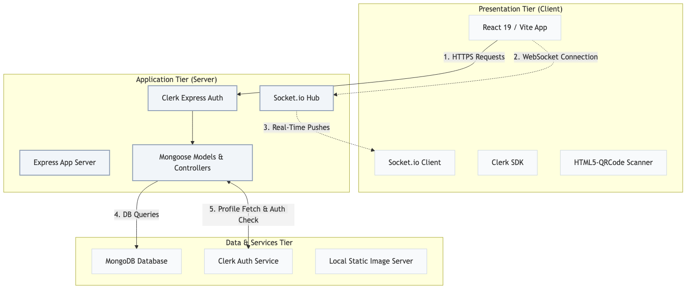
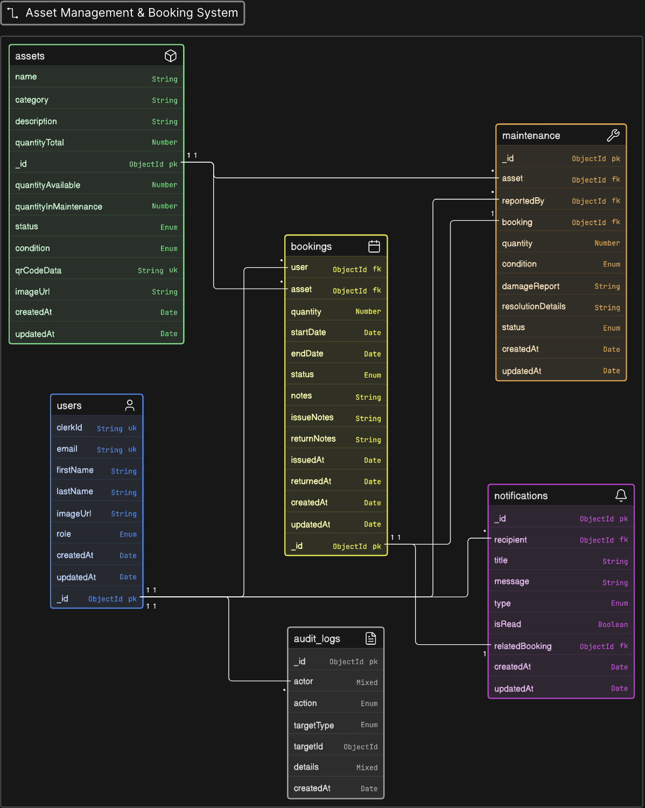

# AssetFlow — System Design & Technical Documentation

This document provides a detailed overview of the system architecture, database schema, entity relationships, API endpoints, and architectural design decisions for AssetFlow.

---

## 1. Problem Understanding

AssetFlow is designed to resolve structural operational issues faced by creative houses and media production facilities managing high-value shared physical assets (such as DSLR cameras, lenses, sound recording equipment, and studio light grids).

### Core Operational Vulnerabilities
* **Manual Checkout Inefficiencies:** Relying on physical sign-out sheets, whiteboards, or offline spreadsheets leads to fragmented records, human verification errors, and slow store operations.
* **Schedule Conflicts & Double Bookings:** The absence of a real-time reservation validation layer allows team members to reserve overlapping slots on identical assets, creating production delays.
* **Overdue & Lost Asset Leakage:** Equipment managers lack immediate visual indicators of overdue gear, making outstanding check-out returns hard to track.
* **Untracked Damage & Maintenance Lag:** Equipment returned in a damaged state frequently slips back into circulation before repair, leading to failures on set.

### Platform Value Objectives
1. **Visual Catalog & Live Availability:** Browse items and verify date-range availability instantly using visual badges (Available, Low Stock, Busy).
2. **Enforced Request Workflows:** All bookings register in a central queue for Administrator vetting, with automatic background availability checkups.
3. **Instant QR Code Issuing/Returns:** Scan physical sticker labels using a webcam or browser camera to instantly check out items or log returns.
4. **Dynamic Maintenance Routing:** Tagging an item as `DAMAGED` on return automatically moves the asset state to `MAINTENANCE` and spawns a repair ticket.
5. **Audit Ledger:** Log every catalog update, checkout, check-in, and repair action to an immutable database audit log.

---

## 2. System Architecture

AssetFlow is built on a modern 3-tier web architecture designed for responsive layout rendering, high performance, and secure data access.

### Architectural Diagram

### Component Data Flows
* **User Authentication & Security:** The client uses the Clerk SDK to retrieve a session JWT. Every API call mounts this token inside the `Authorization` header. The server-side middleware validates the signature and populates the request context with user identities.
* **On-The-Fly Profile Provisioning:** User profiles are checked and auto-provisioned dynamically in MongoDB during JWT token authentication. If a user record is missing locally, the backend calls Clerk's Client API (`clerkClient.users.getUser`) to fetch email, name, and image details, and creates the profile document on-the-fly.
* **Real-Time WebSocket Updates:** Socket.io links client browsers and the backend. On connection initialization, the server authenticates the socket handshake using the Clerk token and joins the client to a user-specific private channel (e.g. `user:user_123`). Admins can push alerts or status updates directly to target rooms.

---

## 3. Database Schema & Data Models

The platform uses MongoDB via Mongoose Schemas to enforce strict document validations and indexes.

### Model: User (Collection: `users`)

| Field | Type | Validation Rules & Description |
| :--- | :--- | :--- |
| `_id` | `ObjectId` | Primary Key. MongoDB auto-generated identifier. |
| `clerkId` | `String` | **Unique Index.** Clerk user identifier syncing profile state. |
| `email` | `String` | **Unique Index.** Lowercase formatted user email address. |
| `firstName` | `String` | Optional profile first name. |
| `lastName` | `String` | Optional profile last name. |
| `imageUrl` | `String` | Optional avatar image path. |
| `role` | `String` | **Required.** Options: `ADMINISTRATOR \| CONSUMER`. Defaults to `CONSUMER`. |

### Model: Asset (Collection: `assets`)

| Field | Type | Validation Rules & Description |
| :--- | :--- | :--- |
| `_id` | `ObjectId` | Primary Key. MongoDB auto-generated identifier. |
| `name` | `String` | **Indexed.** Equipment name tags. |
| `category` | `String` | **Indexed.** Product classifications (e.g., DSLR, Lighting, Audio). |
| `description`| `String` | Detailed summary of the item. |
| `quantityTotal` | `Number` | Total inventory items owned (Min: 0, Default: 1). |
| `quantityAvailable` | `Number` | Active stock count for immediate checkouts (Min: 0, Default: 1). |
| `quantityInMaintenance` | `Number` | Sidelined repair queue count (Min: 0, Default: 0). |
| `status` | `String` | Options: `AVAILABLE \| MAINTENANCE \| RETIRED`. |
| `condition` | `String` | Options: `EXCELLENT \| GOOD \| FAIR \| DAMAGED`. |
| `qrCodeData` | `String` | **Unique Index.** String template used for scanning checkouts. |

### Model: Booking (Collection: `bookings`)

| Field | Type | Validation Rules & Description |
| :--- | :--- | :--- |
| `_id` | `ObjectId` | Primary Key. MongoDB auto-generated identifier. |
| `user` | `ObjectId` | Foreign Key (Ref: `User`). User placing the checkout. |
| `asset` | `ObjectId` | Foreign Key (Ref: `Asset`). Equipment reserved. |
| `quantity` | `Number` | Reservation quantity count (Min: 1, Default: 1). |
| `startDate` | `Date` | Checkout period start timestamp. |
| `endDate` | `Date` | Checkout return deadline timestamp. |
| `status` | `String` | Options: `PENDING \| APPROVED \| REJECTED \| ISSUED \| RETURNED \| CANCELLED \| OVERDUE`. |
| `notes` | `String` | Optional notes added by the user during reservation. |
| `issueNotes` | `String` | Optional notes added by the admin during handout. |
| `returnNotes`| `String` | Optional notes added by the admin during check-in. |
| `issuedAt` | `Date` | Timestamp tracking physical handout. |
| `returnedAt` | `Date` | Timestamp tracking physical return. |

### Model: Maintenance (Collection: `maintenances`)

| Field | Type | Validation Rules & Description |
| :--- | :--- | :--- |
| `_id` | `ObjectId` | Primary Key. MongoDB auto-generated identifier. |
| `asset` | `ObjectId` | Foreign Key (Ref: `Asset`). Equipment sidelined for repair. |
| `reportedBy` | `ObjectId` | Foreign Key (Ref: `User`). User filing the ticket. |
| `booking` | `ObjectId` | Optional Foreign Key (Ref: `Booking`). Booking that caused the damage. |
| `quantity` | `Number` | Count of sidelined items (Min: 1). |
| `condition` | `String` | Current condition: `DAMAGED \| UNDER_REPAIR \| RESOLVED`. |
| `damageReport` | `String` | Details describing the damage. |
| `resolutionDetails` | `String` | Administrative comments logged during repair resolution. |
| `status` | `String` | Lifecycle: `OPEN \| IN_PROGRESS \| RESOLVED`. |

### Model: Notification (Collection: `notifications`)

| Field | Type | Validation Rules & Description |
| :--- | :--- | :--- |
| `_id` | `ObjectId` | Primary Key. MongoDB auto-generated identifier. |
| `recipient` | `ObjectId` | Foreign Key (Ref: `User`). Recipient of the notification. |
| `title` | `String` | Notification header. |
| `message` | `String` | Body content of the notification. |
| `type` | `String` | Options: `BOOKING_REQUEST \| BOOKING_APPROVED \| BOOKING_REJECTED \| RETURN_REMINDER \| OVERDUE`. |
| `isRead` | `Boolean` | Read indicator. Defaults to `false`. |
| `relatedBooking` | `ObjectId` | Optional Foreign Key (Ref: `Booking`). |

### Model: AuditLog (Collection: `auditlogs`)

| Field | Type | Validation Rules & Description |
| :--- | :--- | :--- |
| `_id` | `ObjectId` | Primary Key. MongoDB auto-generated identifier. |
| `actor` | `Mixed` | Foreign Key (Ref: `User`) OR the literal string `"SYSTEM"`. |
| `action` | `String` | Event catalog classification (e.g., `ASSET_CREATE \| BOOKING_APPROVE \| ASSET_RETURN`). |
| `targetType` | `String` | Collection name of target entity (e.g., `'Asset' \| 'Booking'`). |
| `targetId` | `ObjectId` | Polymorphic reference pointing to target entity. |
| `details` | `Mixed` | Free-form JSON storing state differences or changes. |
| `createdAt` | `Date` | Timestamp tracking log creation. No `updatedAt` is generated. |

### System Business Rules & Constraints
* **Balance Validation Formula:** Mongoose models trigger a pre-save check verifying:
    $$\text{quantityAvailable} + \text{quantityInMaintenance} \le \text{quantityTotal}$$
    If this condition fails, the update is aborted to prevent data corruption.
* **Temporal Logic Check:** Checkout validation checks that booking start dates precede return deadlines ($\text{startDate} \le \text{endDate}$). Checkouts scheduled in the past are rejected.
* **Audit Trail Immutability:** The `AuditLog` collection omits the Mongoose `updatedAt` timestamps and blocks all `UPDATE` and `DELETE` requests via database middleware to secure compliance logs.
* **Polymorphic Logging:** `AuditLog.actor` can store either a User ObjectId reference or the literal string `"SYSTEM"`. The `targetId` field represents a polymorphic reference resolved dynamically using `targetType` ('Asset', 'Booking', etc.).

---

## 4. Entity Relationship Diagram (ERD)

### Relational Summary

| Source Entity | Target Entity | Relation Type | Description |
| :--- | :--- | :--- | :--- |
| **User** | **Booking** | One-to-Many | A user files check-out reservation requests. |
| **Asset** | **Booking** | One-to-Many | An asset is referenced inside multiple bookings. |
| **User** | **Maintenance** | One-to-Many | Admin/storekeeper files equipment repair logs. |
| **Asset** | **Maintenance** | One-to-Many | An asset undergoes physical repair tracking. |
| **Booking** | **Maintenance** | One-to-One (Opt) | Damage on check-in triggers a maintenance log. |
| **User** | **Notification** | One-to-Many | A user receives in-app notifications. |
| **Booking** | **Notification** | One-to-One (Opt) | Notifications reference booking contexts. |
| **User** | **AuditLog** | One-to-Many | Admin actions are mapped to actor trails. |

---

## 5. API Overview

The backend mounts a structured RESTful API under the `/api` prefix, securing routes using Clerk JWT verification and role-based access control (RBAC).

### API Routes & Permissions Matrix

| Endpoint | Method | Required Role | Function & Operations |
| :--- | :--- | :--- | :--- |
| `/api/users/me` | `GET` | Authenticated | Fetches Clerk-verified user details from the database. |
| `/api/assets` | `GET` | Authenticated | Fetches browse catalog details with availability states. |
| `/api/assets` | `POST` | `ADMINISTRATOR` | Creates a new catalog asset item. |
| `/api/assets/:id` | `PUT` | `ADMINISTRATOR` | Updates catalog item technical details. |
| `/api/assets/:id` | `DELETE` | `ADMINISTRATOR` | Soft-deletes/retires an asset from the catalog. |
| `/api/bookings` | `POST` | Authenticated | Submits a checkout request (checks inventory overlaps). |
| `/api/bookings` | `GET` | Authenticated | Lists checkouts (Admins see all, Consumers see self). |
| `/api/bookings/:id/status`| `PATCH`| `ADMINISTRATOR` | Manually actions (Approve/Reject) check-out requests. |
| `/api/bookings/:id/issue` | `POST` | `ADMINISTRATOR` | QR-scanner path. Flags asset booking as `ISSUED`. |
| `/api/bookings/:id/return`| `POST` | `ADMINISTRATOR` | QR-scanner path. Processes return & logs damage states. |
| `/api/bookings/:id/overdue-alert`| `POST` | `ADMINISTRATOR` | Sends manual overdue warning notification to user. |
| `/api/maintenance` | `GET` | `ADMINISTRATOR` | Lists active damaged equipment repair tickets. |
| `/api/maintenance/:id/resolve`| `POST`| `ADMINISTRATOR` | Logs fix details and restores asset availability count. |
| `/api/audit` | `GET` | `ADMINISTRATOR` | Reviews the immutable system action trail logs. |

---

## 6. Key Design Decisions

* *Decision:* Adopted React 19, Vite, Tailwind CSS v4.0, Node.js, Express, and MongoDB.
* *Rationale:* React 19 provides modular interfaces, Vite minimizes local build times, and MongoDB supports flexible inventory document schema adjustments.

* *Decision:* Integrated Clerk for IAM. User profiles are checked and auto-provisioned on-the-fly from Clerk's API during JWT token validation if their database record does not yet exist.
* *Rationale:* Outsources identity management to Clerk while maintaining local database profiles to query user relationships (like bookings and notifications) without the complexity of webhook listeners.

* *Decision:* Authenticate Socket.io handshakes using Clerk JWT tokens. Bound clients to private rooms matching their Clerk user IDs (`user:user_123`).
* *Rationale:* Reuses primary credentials to prevent unauthorized message listening or room spoofing.

---
